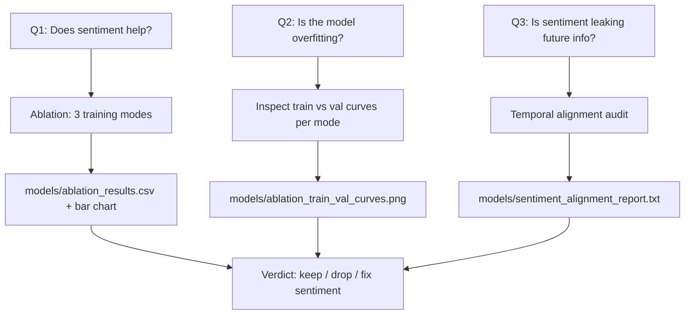

## Validation strategy

We answer three questions, each with a concrete experiment, before touching the architecture:



## Experiment 1 — Ablation across the 3 supported modes

Use the existing CLI in [train.py](train.py). The three modes already toggle the right flags via `TRAINING_MODES`:

- `no-sentiment` — sentiment branch fully disabled (`sentiment_input_size=0`)
- `sentiment-no-cross-attention` — sentiment concat fusion only, no cross-modal attention
- `current` — sentiment + cross-attention (your present model)

**Important issue to fix in the orchestrator**: `Trainer.save_model` in [src/models/trainer.py](src/models/trainer.py) line 369 always writes `best_model.pt`, so consecutive runs overwrite each other. The orchestrator must move the artifact aside after each run.

### Orchestrator script: `scripts/run_ablation_validation.py` (~120 lines)

For each mode:
1. Run training via subprocess: `python train.py --mode <mode> --sentiment-source synthetic`
   - Use `synthetic` for fair, deterministic comparison (sentiment data identical across runs other than what the model uses).
2. After training completes, copy artifacts to mode-specific names:
   - `models/best_model.pt` → `models/ablation_<mode>__best.pt`
   - `models/preprocessing_metadata.pkl` → `models/ablation_<mode>__metadata.pkl`
   - `training_history.png` → `models/ablation_<mode>__history.png`
3. Parse the printed test-set block (`Test Set Results:` + `RMSE`, `MAE`, `MAPE`, `Direction Accuracy`) from stdout. Fallback: re-load the best checkpoint and re-evaluate on the test split.
4. Append a row to `models/ablation_results.csv` with columns: `mode, params, rmse, mae, mape, direction_acc, train_loss_final, val_loss_final, train_val_gap`.

### Output figure 1: `models/ablation_comparison.png`

Grouped bar chart, one cluster per metric (RMSE, MAE, Dir. Acc), three bars per cluster (one per mode). Add the standalone `Transformer` and `XGBoost` rows from `models/model_comparison.csv` as horizontal reference lines so the reader can immediately see whether multimodal beats the best baseline.

## Experiment 2 — Overfitting diagnostic

For each of the 3 saved histories, pull `train_loss` vs `val_loss` from the checkpoint (`history` is already saved inside the `.pt` — see `Trainer.save_model` at [src/models/trainer.py](src/models/trainer.py) line 379) and compute:

- **Final train/val gap** — `val_loss[-1] - train_loss[-1]`
- **Generalization gap trend** — does the gap widen after some epoch (classic overfitting fingerprint)?
- **Best epoch** — argmin of `val_loss`. If best epoch ≪ last epoch → model is overfitting late epochs and would benefit from earlier stopping, not more capacity.

### Output figure 2: `models/ablation_train_val_curves.png`

3 subplots side-by-side, one per mode. Train vs val regression loss on the same axes, with a vertical line at `argmin(val_loss)`.

**Decision rules** to print:
- gap > 30% of train_loss AND `current` mode is worst → overfitting on sentiment → simplify, don't grow.
- gap small AND `current` is worst → sentiment signal genuinely unhelpful for synthetic source → try real Alpha Vantage data before architectural changes.
- gap small AND `current` is best → fusion is working; further capacity is justified.

## Experiment 3 — Sentiment alignment audit (sanity check)

Cheap and high-value. Read `data/processed/sentiment_data.csv` (or whichever file `fetch_sentiment_data` writes) and run these checks in `scripts/audit_sentiment_alignment.py`:

1. **Date coverage** — fraction of trading days with non-default sentiment vs imputed/median-filled values. From [src/data/preprocessing.py](src/data/preprocessing.py) line 64, missing sentiment is filled with median, which inflates SHAP for "constant-ish" features.
2. **Lookahead test** — correlation between `Target_Return` (day t→t+1) and `sentiment_compound` (day t). High positive correlation on the **same day** is normal, but if `sentiment_compound` correlates with future return better than past return, that's a leak (e.g. news from after the close labeled as day t).
3. **Constant-feature check** — variance of each sentiment column. The SHAP CSV shows `sentiment_neutral` has importance `1.3e-20` — that feature is effectively dead. Print which sentiment columns have variance < 1e-6 so they can be dropped.

### Output: `models/sentiment_alignment_report.txt`

Plain-text summary with the three numbers above and a verdict line.

## Time budget

- 3 training runs × ~5–10 min each on your machine = **30 minutes total**, fully scripted.
- Audit script: <5 seconds.
- All artifacts land in `models/` next to your existing comparison files.

## What this gives you for the report

A single table you can paste straight into `Tesla_Multimodal_Stock_Prediction_Report.docx`:

```
Mode                           RMSE   MAE   MAPE   Dir.Acc   Δ vs Transformer
no-sentiment                   ?      ?     ?      ?         ?
sentiment-no-cross-attention   ?      ?     ?      ?         ?
current (multimodal)           ?      ?     ?      ?         ?
Transformer (baseline)         9.87   8.04  1.99   51.3      0
```

Plus the train/val curve figure that justifies "we did not increase model depth because the issue is generalization, not capacity."

## Files touched

- **New**: [scripts/run_ablation_validation.py](scripts/run_ablation_validation.py) — orchestrator (~120 lines).
- **New**: [scripts/audit_sentiment_alignment.py](scripts/audit_sentiment_alignment.py) — alignment diagnostics (~60 lines).
- **New artifacts in** `models/`: `ablation_results.csv`, `ablation_comparison.png`, `ablation_train_val_curves.png`, `ablation_<mode>__best.pt` (×3), `sentiment_alignment_report.txt`.
- **No edits** to `train.py`, `trainer.py`, `fusion.py`, or `config.py`. The training pipeline already supports the three modes natively.
