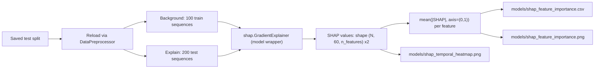

## Goal

Quantify which of the ~50 time-series features (OHLCV, technical indicators, SPY/VIX market context) and the sentiment features most influence the 1-day return prediction of the trained multimodal model. Output a ranked CSV and two figures we can drop into `Tesla_Multimodal_Stock_Prediction_Report.docx`.

## Why GradientExplainer (not DeepExplainer / KernelExplainer)

- `DeepExplainer` does not fully support `nn.MultiheadAttention` (used in `CrossModalAttention` at [src/models/fusion.py](src/models/fusion.py) line 28) — it errors on unregistered op handlers.
- `KernelExplainer` is model-agnostic but ~100x slower for sequence inputs of shape `(60, ~50)`.
- `GradientExplainer` uses expected gradients (a SHAP-consistent variant of Integrated Gradients), works on any differentiable PyTorch model, and handles multi-input models via tuples.

## Data flow



## Key implementation notes

1. **Model wrapper** — `MultimodalFusionModel.forward` returns a dict, but SHAP needs a single tensor output. Wrap it:

```python
class SHAPWrapper(nn.Module):
    def __init__(self, model): super().__init__(); self.model = model
    def forward(self, ts, sent): return self.model(ts, sent)['regression'].unsqueeze(-1)
```

2. **Reuse existing data loading** — call `DataPreprocessor.prepare_data(...)` exactly like [train.py](train.py) does, so the SHAP analysis sees the same scaled features the model was trained on. Load model via `load_trained_model()` in [src/utils/helpers.py](src/utils/helpers.py).

3. **Multi-input explainer** — pass tuples:

```python
explainer = shap.GradientExplainer(wrapper, [ts_bg, sent_bg])
shap_ts, shap_sent = explainer.shap_values([ts_explain, sent_explain])
```

   `shap_ts` shape: `(N, 60, n_price_features)`. `shap_sent` shape: `(N, 60, n_sentiment_features)`.

4. **Aggregation for global importance**

```python
ts_importance   = np.abs(shap_ts).mean(axis=(0, 1))      # (n_price_features,)
sent_importance = np.abs(shap_sent).mean(axis=(0, 1))    # (n_sentiment_features,)
```

   Concatenate with column names from `metadata['feature_columns'] + metadata['sentiment_columns']` and sort descending.

5. **Outputs**
   - `models/shap_feature_importance.csv` — columns: `feature, modality, mean_abs_shap, rank`.
   - `models/shap_feature_importance.png` — horizontal bar chart, top 25 features, color-coded by modality (price/technical/market/sentiment).
   - `models/shap_temporal_heatmap.png` — for the top 8 features, a `feature × timestep` heatmap of mean |SHAP|, showing whether the model relies on recent or distant lags.

6. **Compute budget** — background=100, explain=200 takes ~30–60 s on CPU with the current model size (~1M params). Configurable via CLI flags.

7. **Target output** — default to the regression head (scaled 1-day return). Add `--target {regression, direction_up}` flag to optionally explain the "Up" class logit instead, for a second figure if needed.

## New / modified files

- **New:** [scripts/shap_feature_importance.py](scripts/shap_feature_importance.py) — ~150 lines, single-file CLI script.
- **Touch:** add `shap` to imports; will need `pip install shap` if not already present (verify before running). No edits to model code or training pipeline.

## Acceptance check

- Script runs end-to-end and writes the 3 output artifacts.
- CSV's top features are plausible (e.g., recent close/return, RSI, MACD, sentiment_score should appear in top 15).
- Sum of mean |SHAP| across all features ≈ stable across reruns with fixed seed (sanity check on stochastic background sampling).
