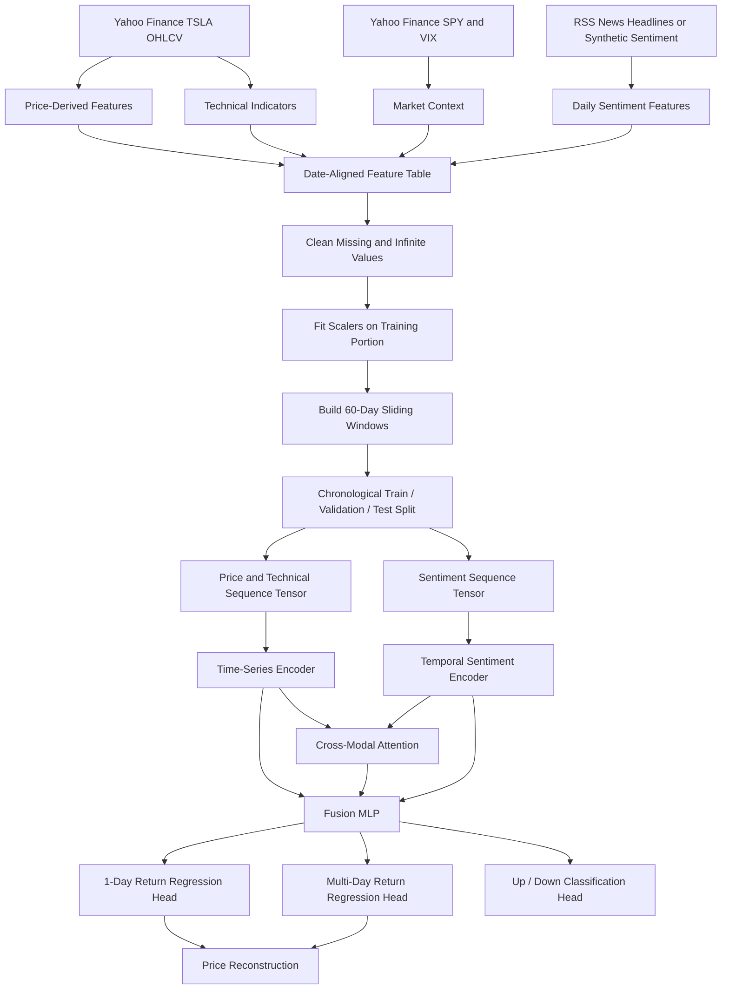

# Architecture Overview

This project predicts Tesla stock returns using a multimodal sequence-learning pipeline. The main idea is to represent the market as two aligned temporal streams: a price/technical stream and a sentiment stream. Each stream is encoded separately, fused, and then used to predict both future return values and price direction.

## End-To-End Flow

## Data Layer

The stock-data layer fetches TSLA OHLCV data from Yahoo Finance. From this base table, the project computes returns, log returns, price range, and price range percentage. These raw market fields are saved under `data/raw/`.

Sentiment can come from two paths. In real-data mode, RSS headlines are fetched and scored with VADER sentiment. In synthetic mode, lagged returns, rolling trends, volatility, and random noise are used to create sentiment-like signals. The synthetic path intentionally uses lagged return information to reduce same-day leakage.

The feature-engineering layer adds technical indicators such as moving averages, RSI, MACD, Bollinger Bands, ATR, OBV, VWAP, stochastic oscillator, momentum, volatility, and candlestick pattern features. It also adds SPY and VIX context plus calendar features.

## Preprocessing Layer

`DataPreprocessor` is responsible for converting tabular financial data into model-ready sequences.

It performs four important jobs:

1. Merge stock, indicator, market, calendar, and sentiment data by date.
2. Clean missing values and infinities.
3. Fit scalers on the training portion only.
4. Create sliding windows of shape `(samples, 60, features)`.

The training split is chronological rather than random, which is appropriate for time-series forecasting. Targets are future returns rather than raw prices. The main target is the 1-day return, while additional targets represent 1, 3, 5, and 7 day returns.

## Model Layer

The main neural model is `MultimodalFusionModel`.

The price branch uses an LSTM-based time-series encoder with attention. This branch learns temporal patterns from OHLCV, technical indicators, market context, and calendar features.

The sentiment branch uses a temporal CNN-based encoder. This keeps the sentiment input as a sequence, allowing the model to learn short-term sentiment patterns rather than averaging the entire sentiment window immediately.

Cross-modal attention connects the two branches. The time-series sequence attends against the encoded sentiment representation, and the result is added back into the time-series representation before fusion.

The fused representation is passed to three heads:

- a single-day return regression head
- a multi-day return regression head for the configured horizons
- a classification head for down/neutral/up direction

## Training Layer

The training loop uses AdamW, OneCycleLR, gradient clipping, and full fixed-epoch training. The loss combines:

- Smooth L1 loss for 1-day return regression
- Smooth L1 loss for multi-day return regression
- cross-entropy loss for direction classification

During evaluation, predicted scaled returns are inverse-transformed and converted into reconstructed future prices. RMSE, MAE, and MAPE are calculated on dollar-price predictions, while direction accuracy is calculated from predicted and actual returns.

## Inference Layer

`predict.py` loads the trained fusion checkpoint and preprocessing metadata from `models/`. It fetches the latest stock and sentiment data, calculates indicators, applies the saved feature scaler, extracts the final 60-day sequence, and predicts future returns. Those returns are then converted into predicted prices using the current closing price.

The Streamlit app follows the same core inference pattern, then presents charts, prediction cards, multi-day forecasts, model comparison, and SHAP explainability.

## SHAP Explainability Layer

The dashboard uses SHAP-based feature analysis. It trains an XGBoost surrogate on the engineered tabular feature set and the next-day return target, then uses `shap.TreeExplainer` to estimate how each feature contributes to the surrogate prediction.

The SHAP tab reports global importance through mean absolute SHAP values and provides a feature-level dependence view. This is a better evaluation aid than a plain correlation matrix because it can reflect non-linear relationships and feature interactions captured by the surrogate model.

## Baseline Comparison

`model_comparison.py` uses the same preprocessing pipeline but concatenates price/technical and sentiment features into a single tensor for standalone regressors. It trains LSTM, GRU, Transformer, and XGBoost models, then compares them using reconstructed price metrics.

The saved comparison CSV currently contains LSTM, GRU, and XGBoost results. This should be regenerated if Transformer results are required in the final report.
