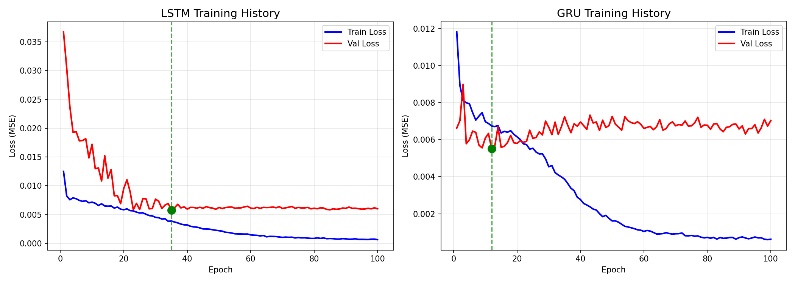

# Tesla Stock Price Prediction Using Multimodal Deep Learning

A comprehensive stock price prediction system that combines time-series analysis with sentiment data using deep learning models (LSTM, GRU) and machine learning (XGBoost).



## 📋 Overview

This project predicts Tesla (TSLA) stock prices using a **returns-based approach**:
1. Predicts daily percentage returns (more stationary than raw prices)
2. Reconstructs actual prices: `predicted_price = today_close × (1 + predicted_return)`

### Models Implemented
- **LSTM** - Long Short-Term Memory (Bidirectional, 2 layers)
- **GRU** - Gated Recurrent Unit (Bidirectional, 2 layers)
- **XGBoost** - Gradient Boosting for comparison

### Features Used
- **Price Data**: OHLCV (Open, High, Low, Close, Volume)
- **Technical Indicators**: SMA, EMA, RSI, MACD, Bollinger Bands, ATR, OBV, VWAP
- **Sentiment Data**: News sentiment scores (synthetic or real)
- **Derived Features**: Daily returns, price momentum, volatility

## 🏗️ Project Structure

```
├── app/
│   └── streamlit_app.py      # Interactive web dashboard
├── data/
│   ├── raw/                  # Raw stock & sentiment data
│   └── processed/            # Preprocessed sequences
├── models/                   # Saved model checkpoints
├── notebooks/
│   └── exploration.ipynb     # Data exploration & analysis
├── src/
│   ├── data/
│   │   ├── stock_data.py     # Yahoo Finance data fetcher
│   │   ├── sentiment_data.py # Sentiment data generator
│   │   └── preprocessing.py  # Data preprocessing pipeline
│   ├── features/
│   │   └── technical.py      # Technical indicator calculations
│   ├── models/
│   │   ├── regression_models.py  # LSTM, GRU, XGBoost models
│   │   └── trainer.py        # Training utilities
│   └── utils/                # Helper functions
├── config.py                 # Configuration settings
├── train.py                  # Main training script
├── train_comparison.py       # Model comparison training
├── predict.py                # Prediction script
└── requirements.txt          # Dependencies
```

## 🚀 Quick Start

### 1. Installation

```bash
# Clone the repository
git clone <repository-url>
cd "Stock price prediction using multimodal"

# Create virtual environment
python -m venv venv
source venv/bin/activate  # On Windows: venv\Scripts\activate

# Install dependencies
pip install -r requirements.txt
```

### 2. Train Models

```bash
# Train all models (LSTM, GRU, XGBoost)
python train.py

# Or run model comparison
python train_comparison.py
```

### 3. Run Streamlit Dashboard

```bash
streamlit run app/streamlit_app.py
```

## ⚙️ Configuration

Edit `config.py` to customize:

```python
# Data settings
STOCK_SYMBOL = "TSLA"
START_DATE = "2010-06-29"
SEQUENCE_LENGTH = 60  # Look-back window (days)

# Model architecture
MODEL_CONFIG = {
    "ts_hidden_size": 128,
    "ts_num_layers": 2,
    "ts_dropout": 0.2,
    "ts_bidirectional": True,
}

# Training settings
TRAINING_CONFIG = {
    "batch_size": 32,
    "learning_rate": 1e-4,
    "epochs": 200,
    "early_stopping_patience": 30,
}
```

## 🖥️ GPU Support

The project supports:
- **CUDA** (NVIDIA GPUs)
- **MPS** (Apple Silicon M1/M2/M3)
- **CPU** (fallback)

Device selection is automatic. To verify:
```python
import torch
print(torch.backends.mps.is_available())  # For Mac
print(torch.cuda.is_available())          # For NVIDIA
```

## 📊 Model Architecture

### LSTM/GRU
```
Input (60 timesteps × 57 features)
    ↓
Bidirectional LSTM/GRU (128 hidden, 2 layers)
    ↓
Dropout (0.2)
    ↓
Dense (1 output - predicted return)
```

### XGBoost
- 100 estimators
- Max depth: 6
- Learning rate: 0.1
- Subsample: 0.8

## 📈 Metrics

- **RMSE** - Root Mean Square Error (in dollars)
- **MAE** - Mean Absolute Error (in dollars)
- **MAPE** - Mean Absolute Percentage Error
- **Direction Accuracy** - Correctly predicted Up/Down movements

## 🎯 Tasks

The system performs:
1. **Regression**: Predict next-day closing price
2. **Classification**: Predict price direction (Up/Down)

## 📝 Usage Examples

### Make Predictions
```python
from src.models.regression_models import MultiModelPredictor
from src.data.preprocessing import prepare_data

# Load data
X_train, X_val, X_test, y_train, y_val, y_test, scalers = prepare_data()

# Load trained model
model = MultiModelPredictor()
model.load_models('models/')

# Predict
predictions = model.predict(X_test)
```

### Streamlit Dashboard Features
- Real-time stock data visualization
- Model predictions with confidence intervals
- Technical indicator charts
- Model performance comparison
- Historical accuracy analysis

## 🛠️ Technical Stack

| Category | Technologies |
|----------|-------------|
| Deep Learning | PyTorch, Transformers |
| ML | Scikit-learn, XGBoost |
| Data | Pandas, NumPy, yfinance |
| Visualization | Matplotlib, Seaborn, Plotly |
| Web App | Streamlit |
| NLP | NLTK, VADER, FinBERT |

## 📚 References

- [LSTM Networks](https://www.bioinf.jku.at/publications/older/2604.pdf) - Hochreiter & Schmidhuber
- [GRU](https://arxiv.org/abs/1406.1078) - Cho et al.
- [XGBoost](https://arxiv.org/abs/1603.02754) - Chen & Guestrin
- [FinBERT](https://arxiv.org/abs/1908.10063) - Financial Sentiment Analysis

## 📄 License

This project is for educational purposes (UTS 49275 Neural Networks and Fuzzy Logic).

## 👤 Author

UTS Master's Student - Neural Networks and Fuzzy Logic Project